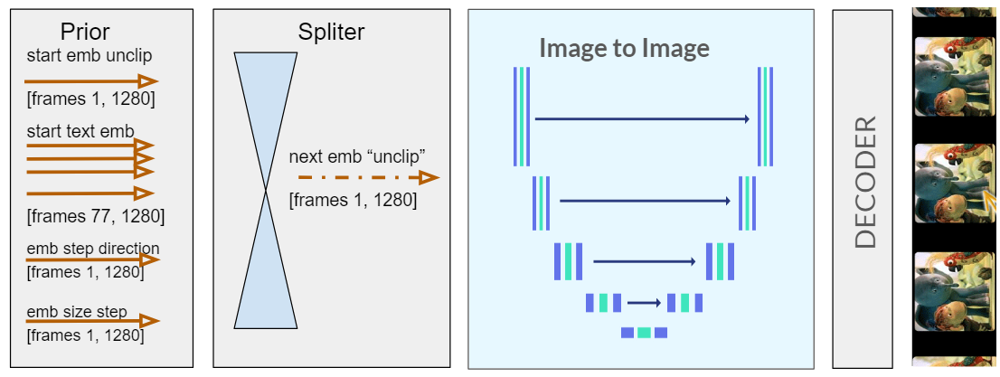
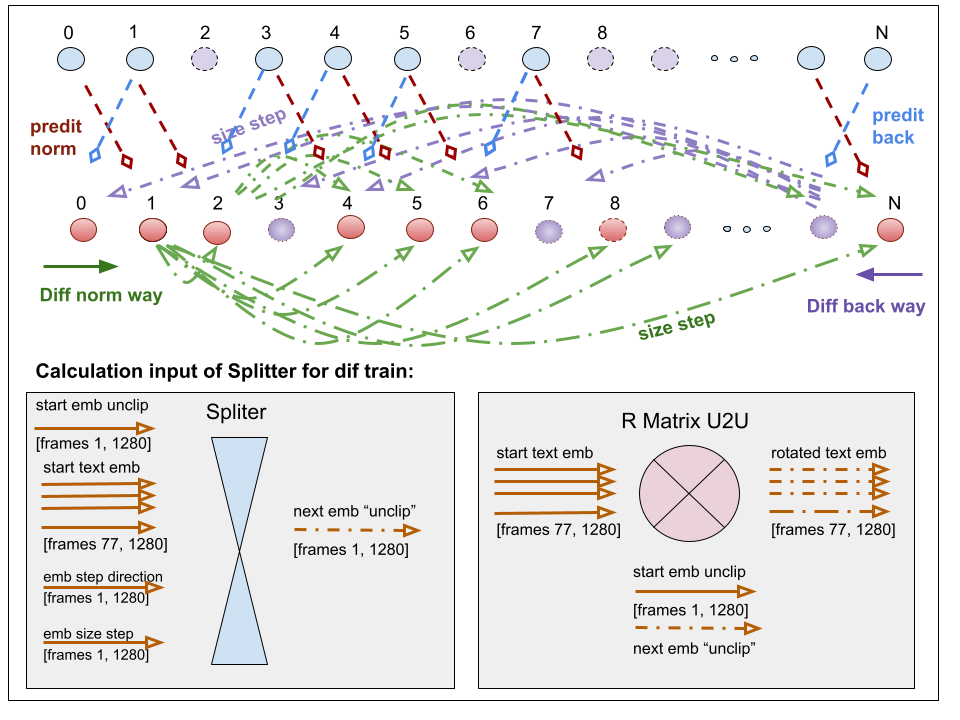

# Концепция составного обучения модели предсказанию нового состояния
## на примере задачи перевода  Text_2_Image в Text_2_Video

Основан на [предыдущих исследованиях](https://github.com/Mike030668/MIPT_magistratura/tree/main/Text2Video_project) концепции матриц вращений  

## Базовое обучение модели для генерации определенного кадра

### первые результаты
#### на малом тематическом наборе из TGIF без контроля разрешения
      
____________________________________________

# Далее показаны генерации с одинаковыми текстами и seed для сравнения
### *Генерации сделаны через 4-8 кадров, по разному. Задача пока не состояла в создании фильна, а скорее показать возможность генерации связанных кадров из стандартной и необученной на близких кадрах диффузионной модели. В данной работе используется unclip модель Kandinsky_22. Но все это применимо и к типичным диффузионным моделям*

## Модель Spliter дополняет стандартную модель Kandinsky_22, следующем образом

## Базовое обучение модели для генерации определенного кадра
#### на случайном наборе 500 видео 350-500px
  
____________________________________________

## Добавление матриц вращения к базовому обучению модели для генерации определенного кадра с произвольного момента

### первые результаты
#### на случайном наборе 500 видео 350-500px
  
____________________________________________

## Добавление генерации из генерации к базовому обучению модели для генерации определенного кадра с произвольного момента

### первые результаты
#### на случайном наборе 500 видео 350-500px
  
____________________________________________

## Комбинированое обучение на всех техниках на каждой эпохе
### первые результаты
#### на случайном наборе 500 видео 350-500px
  
____________________________________________

## Генерация из генерации цепочкой через матрицу вращения
   
____________________________________________

# Просто некоторые интересные генерации
    

____________________________________________

### *Изучение применения матриц вращения как для тренировки сеией, так и применения внутри сети, мной только начато. Обучение построено на выучивания сеть разности в кадре как в пиксельном, так и в косинусном пространстве, поэтому требуется переход на датасет более высокогго разрешения. Далее также стоит усложнить уже саму сеть и добавить слои вращения и кросс_внимания. Кроме того, необходимо дообучать и модели Кандинского на техже датасета, для лучшей согласованной работы.*
## **Но самое важное, это то, что данный метод применим не только к текцщей задаче. Матрицы вращения, это интересный сбособ передачи косвенной информации между признаками в многомерном пространстве**
